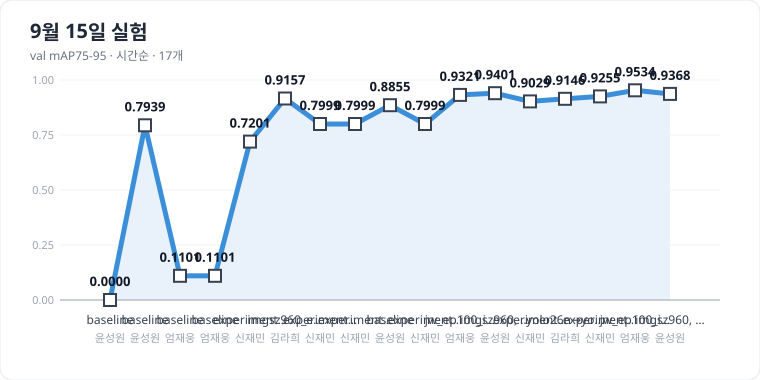
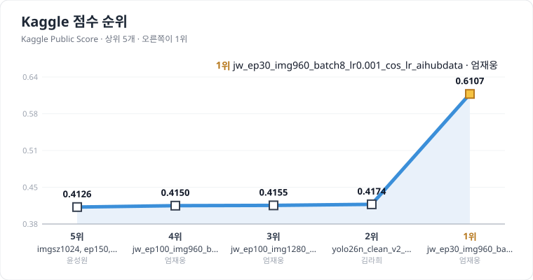

# pill-detection

YOLO로 이미지 속 알약을 탐지하고 종류를 분류하는 프로젝트입니다.

- **입력**: 여러 알약이 함께 놓인 이미지
- **출력**: 알약별 바운딩 박스 + 클래스 + 신뢰도
- **데이터**: Kaggle 대회 `ai14-level-project` 제공 데이터 (AI Hub 「경구약제 이미지 데이터」 조합경구약제 기반)
- **평가**: Kaggle 리더보드 **mAP[0.75:0.95]**, 최종 순위는 Private Score 기준
- **팀**: 4명 / 기간 약 4일

Kaggle 점수 TOP 5 순위는 [실험 기록](#실험-기록)에서 볼 수 있습니다.

## 시작하기

```bash
git clone <repo-url>
cd pill-detection
uv sync
```

`uv sync`만 하면 팀원 전원이 동일한 환경이 됩니다. 패키지는 `uv add <pkg>`로 추가하고 `uv.lock`을 꼭 커밋합니다. (`pip` 사용 금지)

프로젝트 루트에 `.env`를 만듭니다. `.env`는 gitignore 되어 있으며 **절대 커밋하지 않습니다.**

```
KAGGLE_USERNAME=<캐글 아이디>
KAGGLE_KEY=<API 키>
SHEET_URL=<실험 기록 구글 시트 웹앱 URL>   # 팀 채팅으로 공유
AUTHOR=<본인 이름>                          # 실험 기록의 author 칸
```

## 전체 실행 순서

```bash
uv run --env-file .env python src/download_data.py   # 1. Kaggle 데이터 다운로드
uv run python src/make_yolo.py                       # 2. 라벨 정리 + COCO JSON → YOLO 변환 + train/val 분할
uv run python src/check_yolo.py                      #    변환 결과 검증
uv run python src/train.py                           # 3. 학습 + val 평가 + 실험 기록(csv·구글 시트)
uv run python src/visualize.py                       # 4. val 예측 시각화 · 실패 사례 · 클래스별 점수
uv run python src/predict.py                         # 5. test 예측 → Kaggle 제출 파일
```

## 디렉터리

```
data/raw/      Kaggle 원본 데이터 (git 제외)
data/yolo/     YOLO 형식으로 변환된 데이터셋 (git 제외)
runs/          학습 결과 · 가중치 · 분석 그림 · 제출 파일 (git 제외)
src/           데이터 · 학습 · 평가 · 기록 스크립트
docs/images/   README 실험 그래프 (GitHub Actions가 자동 갱신)
.github/       이슈·PR 템플릿, README 그래프 갱신 워크플로
```

| 파일 | 역할 |
|---|---|
| `src/download_data.py` | Kaggle 대회 데이터를 `data/raw/`에 다운로드 |
| `src/annotations.py` | (이미지 × 알약)당 JSON 1개인 라벨을 이미지 파일명 기준으로 묶기 |
| `src/check_data.py` | 데이터 요약 + 박스 시각화 |
| `src/make_yolo.py` | 문제 있는 이미지 제외 → YOLO 라벨 변환 → 조합 단위 train/val 분할 |
| `src/check_yolo.py` | YOLO 라벨을 픽셀로 되돌려 원본과 비교 |
| `src/train.py` | 학습, val 평가(mAP75-95), 실험 기록 |
| `src/visualize.py` | val 예측/정답 비교 그림, 오류 유형 집계, 클래스별 AP, 학습 곡선 |
| `src/predict.py` | test 842장 예측 → 제출 형식 csv |
| `src/sheet.py` | 구글 시트(Apps Script 웹앱)로 실험 기록 전송 |
| `src/plot_experiments.py` | 시트 기록으로 README 실험 그래프(SVG) 생성 |

## 데이터

```
data/raw/sprint_ai_project1_data/
├── train_images/        학습 이미지 (.png)
├── train_annotations/   K-<조합>_json/K-<약품코드>/*.json
└── test_images/         제출용 이미지 (.png, 라벨 없음, 파일명 = 숫자)
```

어노테이션은 **(이미지 × 알약)당 JSON 1개**인 COCO 형식이고, bbox는 `(x, y, w, h)` 픽셀 좌표(좌상단 기준)입니다.

| 항목 | 값 |
|---|---|
| train 이미지 | 232장 |
| 박스 (JSON) | 763개 |
| 클래스 | 56개 |
| test 이미지 | 842장 |
| 이미지당 알약 수 | 2알 7장 / 3알 151장 / 4알 74장 |
| 이미지 크기 | 976 × 1280 (train·test 전체) |

외부 데이터는 사용 가능하지만, AI Hub의 아래 2개는 **사용 금지**입니다. (경진대회 train/test 데이터의 원본)

- `Training > 라벨링데이터 > 경구약제조합 5000종 > TL_2_조합.zip`
- `Training > 원천데이터 > 경구약제조합 5000종 > TS_2_조합.zip`

## 전처리

`src/make_yolo.py`가 아래 순서로 `data/yolo/`를 만듭니다.

**1. 문제 있는 이미지 제외 (232장 → 220장)**

| 제외 이유 | 장수 | 판단 방법 |
|---|---|---|
| 라벨 빠짐 | 8 | 파일명의 약 ID(`K-003351-032310-038162` → 3351·32310·38162) 중 박스 라벨이 없는 약이 있음 |
| 라벨 겹침 | 3 | 한 알약 박스에 서로 다른 약 라벨 2개가 같은 좌표로 붙어 있음 |
| 박스가 이미지 밖 | 1 | 좌표가 이미지 크기를 넘음 (x=6567) |

박스만 빼지 않고 이미지째 뺍니다. 라벨이 빠진 알약은 학습 때 '배경'으로 배워서 모델이 그 알약을 무시하게 되기 때문입니다. 제외해도 train에서 사라지는 클래스는 없습니다.

**2. 클래스 번호** · 약 ID(1900, 2483, …)를 정렬해 YOLO 번호 0~55로 매핑. `data.yaml`의 `names`가 번호 → 약 ID 표입니다.

**3. train/val 분할** · **조합 단위**로 8:2 (seed 42). 같은 조합을 70°/75°/90°로 찍은 사진이 train과 val에 섞이면 val 점수가 부풀려지기 때문입니다.

| 결과 | 값 |
|---|---|
| train / val | 181장 / 39장 |
| val에만 있는 클래스 | `33009` (학습 불가) |
| 변환 검증 (`check_yolo.py`) | 라벨 220개, 원본과 불일치 0개 |

## 학습

`src/train.py` 위쪽 설정만 바꿔서 실험합니다.

```python
MODEL  = "yolo26n.pt"     # 모델 크기
EPOCHS = 100              # 학습 바퀴 수
IMGSZ  = 960              # 입력 이미지 크기
BATCH  = 8                # 한 번에 넣는 사진 수 (64장마다 1번 업데이트는 BATCH와 무관하게 유지)
NAME   = "jw_clean_base"  # 실험 이름 = runs/<NAME>/ (실험마다 새 이름)
MEMO   = "무엇을 왜 바꿨는지 한 줄"
EXPERIMENT = {"optimizer": "AdamW", "lr0": 0.001}  # 나머지 하이퍼파라미터
```

- **한 실험에서는 설정 하나만** 바꾸고, NAME은 `이니셜_바꾼항목`으로 짓습니다. 같은 NAME이면 결과가 덮어써집니다.
- `optimizer`가 기본값 `auto`면 `lr0`·`momentum`을 넣어도 무시됩니다. 학습률을 바꿀 땐 `optimizer`도 같이 지정합니다.
- EPOCHS가 다르면 워밍업 비율·mosaic 끄는 시점도 달라집니다. 같은 EPOCHS끼리 비교합니다.
- 16GB 맥에서 IMGSZ 960·BATCH 16은 메모리가 부족해 스왑이 발생했습니다. 960에서는 BATCH 8을 씁니다.

학습이 끝나면 best.pt로 val을 평가해 mAP50 / mAP50-95 / **mAP75-95**(대회 지표 구간)를 출력하고, `runs/experiments.csv`와 구글 시트에 한 줄 기록합니다.

| 결과 파일 | 내용 |
|---|---|
| `runs/<NAME>/weights/best.pt` | val mAP50-95가 가장 높았던 가중치 |
| `runs/<NAME>/args.yaml` | 실제로 쓰인 설정값 전체 (기본값 포함) |
| `runs/<NAME>/results.csv` | epoch별 loss · mAP · 학습률 |
| `runs/<NAME>_val/` | confusion matrix, PR 곡선 |
| `runs/experiments.csv` | 실험마다 점수 + 학습 인자 (로컬 백업) |

## 평가 · 시각화

```bash
uv run python src/visualize.py   # train.py 의 NAME 실험을 분석
```

val 예측을 정답과 IoU로 짝지어 분류하고 `runs/<NAME>_analysis/`에 저장합니다.

| 분류 | 뜻 |
|---|---|
| OK | 클래스·위치 모두 맞음 (IoU 0.75 이상) |
| LOC | 클래스는 맞고 위치 부정확 (IoU 0.75 미만) |
| CLS | 위치는 맞고 클래스 틀림 |
| DUP | 같은 알약에 예측을 2개 냄 |
| FP | 알약이 없는 곳을 예측 |
| FN | 정답 알약을 놓침 |

- `failures.png` · 실패가 있는 이미지 6장. 박스 **위 글자 = 모델 예측**, **아래 글자 = 정답 라벨**
- `class_ap.csv` · 클래스별 AP50 · AP75-95 (낮은 순)
- `curves.png` · epoch별 box/cls loss, val mAP

## 결과

| 실험 | 데이터 | 설정 | val mAP50 | val mAP50-95 | val mAP75-95 | Kaggle Public |
|---|---|---|---|---|---|---|
| baseline | 정리 전 (val 42장) | yolo26n · 640 · 50 epoch · BATCH 16 · 기본값 | 0.7876 | 0.7550 | 0.7225 | 0.2356 ※ |
| jw_ep100_img960_batch8_lr0.00 | 정리 전 (val 42장) | yolo26n · 960 · 100 epoch · BATCH 8 · AdamW lr0 0.001 | 0.9456 | 0.9388 | 0.9321 | 0.39139 |

※ 같은 baseline 설정을 다른 컴퓨터에서 학습한 실행(val mAP75-95 0.7179)의 제출 점수입니다.
라벨 정리 후에는 val이 39장으로 바뀌어 위 val 점수와 직접 비교하지 않습니다. 전체 기록은 아래 「실험 기록」과 팀 구글 시트를 기준으로 합니다.

**val 오류 유형 (`visualize.py`, 신뢰도 0.25 이상, 정답 박스 131개)**

| 실험 | OK | LOC | CLS | DUP | FP | FN |
|---|---|---|---|---|---|---|
| baseline | 93 | 0 | 24 | 17 | 3 | 14 |
| 960 · 100 epoch · AdamW | 123 | 0 | 3 | 2 | 3 | 5 |

- 두 실험 모두 **LOC 0개** · 박스 위치는 처음부터 정확했고, 점수를 깎은 것은 분류와 중복 예측이었습니다.
- 960 · 100 epoch 조합에서 CLS 24 → 3, DUP 17 → 2로 줄었습니다. (세 설정을 함께 바꿔 각각의 효과는 분리되지 않음)
- 이 조합에 남은 오류 13개 중 FP 3개 전부, CLS 2개, FN 1개는 **라벨 오류 이미지**에서, FN 3개는 train에 없는 **33009**에서 나왔습니다. → 전처리에서 라벨 오류 이미지를 제외한 이유
- val mAP75-95 0.93과 Kaggle 0.39의 차이가 커서, 이후 실험은 Kaggle 점수를 최종 판단 기준으로 봅니다.

## 실험 기록

<!-- 실험그래프 시작 -->
### 📅 9월 16일 실험



| 순서 | 시간 | name | author | memo | val mAP75-95 | kaggle_score |
|---|---|---|---|---|---|---|
| 1 | 09-16 09:26 | imgsz960, ep50, batch16 | 윤성원 | epoch를 50으로 조절함 patience는 의미가 없어보여 하이퍼파라미터에서 제외 | 0.9172 |  |
| 2 | 09-16 09:36 | yolo26n_clean_ep150 | 김라희 | 라벨 정제(중복 3장 제외) + train 누락 클래스(33009) 복구 + cls 1.0 + weight_decay 0.001 + epochs150/patience60/close_mosaic45 + predict conf 재검증(0.4 vs 0.15~0.2) | 0.9929 | 0.3938 |
| 3 | 09-16 09:59 | jw_ep100_img960_batch8_lr0.001_resplit | 엄재웅 | epochs: 100 / imgsz: 960 / batch: 8 / lr: 0.001 / val 재분할(train에 모든 클래스가 학습될 수 있도록) | 0.984 | 0.41504 |
| 4 | 09-16 09:59 | imgsz960, ep50, batch=4 | 윤성원 | batch 영향을 확인하기 위해 4로 설정 | 0.9146 |  |
| 5 | 09-16 10:50 | imgsz960, ep50, batch=4, | 윤성원 | 학습은 가볍게 하기 위해 epochs=50, batch=4로 줄임 / make_yolo.py 에서 모든 클래스가 학습 될 수 있게 코드 수정 | 0.9719 |  |
| 6 | 09-16 11:17 | yolo26n_clean_v2 | 김라희 | yolo26n_clean_ep150 설정 유지 + 라벨 누락 의심 이미지 8장 추가 제외(콤보명-실제라벨 불일치, 3351 4건 포함), imgsz는 960 유지 | 0.995 | 0.4062 |
| 7 | 09-16 11:19 | experiment_05_model_s | 신재민 | 이미지 크기와 augmentation 설정은 그대로 두고 모델만 N → S로 변경하여 모델 크기에 따른 성능 변화를 확인한다. | 0.9346 |  |
| 8 | 09-16 11:36 | imgsz960, ep100, batch=4 버젼 2 | 윤성원 | 모든 클래스가 포함 될 수 있게 make_yolo 수정, epochs=100으로 다시 재검사 | 0.9808 |  |
| 9 | 09-16 11:44 | experiment_06_epochs100 | 신재민 | 이미지 크기와 augmentation 설정은 그대로 두고 모델만 N → S로 변경하였던 값에 epochs를 50에서 100으로 늘려보았다. | 0.8093 |  |
| 10 | 09-16 12:08 | jw_ep100_img1280_batch4_lr0.001_fit75 | 엄재웅 | epochs: 100 / imgsz: 1280 / batch: 4 / lr: 0.001 / best.pt 기준 변경(대회지표로) | 0.984 | 0.40805 |
| 11 | 09-16 12:08 | imgsz1280, ep50, batch=4 | 윤성원 | epochs=50, imgsz=1280으로 재검사 | 0.9419 |  |
| 12 | 09-16 12:40 | imgsz640, ep50, batch=4 | 윤성원 | epochs=50, imgsz=640으로 재학습 (imgsz960 대비 imgsz1280이 오히려 mAP 점수가 떨어지는 현상 발견) | 0.9568 |  |
| 13 | 09-16 13:27 | imgsz1024, ep50, batch=4 | 윤성원 | imgsz1024로 학습 진행 후 imgsz 960 대비 어떻게 달라지는지 확인(imgsz는 32배수로 설정) | 0.9888 |  |
| 14 | 09-16 14:09 | experiment_07_model_m | 신재민 | S → M 모델 변경, mAP75-95 성능 비교 | 0.9283 |  |
| 15 | 09-16 14:12 | imgsz896, ep50, batch=4 | 윤성원 | imgsz896 imgsz960과 1024와 비교를 위해 실험 | 0.9586 |  |
| 16 | 09-16 14:33 | yolo26n_imgsz1280_v3 | 김라희 | imgsz 1280 + 회전증강(degrees 15) + close_mosaic 30 + cls 1.5 (클래스 혼동 방지) + patience 30 | 0.9342 |  |
| 17 | 09-16 14:35 | imgsz1024, ep50, batch=12 | 윤성원 | imgsz 값들 중 1024가 점수가 제일 높음, batch 12 값 테스트 (이후 batch=8 테스트) | 0.9808 |  |
| 18 | 09-16 14:40 | experiment_08_split_fix | 신재민 | 33009 학습 누락 보정 후 재학습. mAP75-95 0.6612로 하락. VAL 데이터 차이에 따른 성능 저하 원인 분석 예정. | 0.6612 |  |
| 19 | 09-16 14:55 | jw_ep100_img960_batch4_lr0.001_yolo26s | 엄재웅 | epochs: 100 / imgsz: 960 / batch: 4 / lr: 0.001 / yolo26s | 0.981 |  |
| 20 | 09-16 14:57 | imgsz1024, ep50, batch=8 | 윤성원 | batch = 8로 재학습) | 0.9732 |  |
| 21 | 09-16 15:06 | experiment_09_class_balance | 신재민 | 클래스 분포를 고려해 TRAIN/VAL을 재분할 후 재학습. 기존 조건(S/960/50)을 유지해 분할 변경에 따른 성능 차이 확인. | 0.6865 |  |
| 22 | 09-16 15:19 | experiment_10_reproduce_exp05 | 신재민 | Exp05와 동일한 Combo 기준 Train/Val 분할 및 학습 조건으로 재현 | 0.942 |  |
| 23 | 09-16 15:41 | experiment_11_imgsz1280 | 신재민 | 기본값 베이스라인 | 0.7163 |  |
| 24 | 09-16 15:59 | jw_ep100_img960_batch8_lr0.001_clspw0.5 | 엄재웅 | epochs: 100 / imgsz: 960 / batch: 8 / lr: 0.001 / cls_pw 0.5 (희소 클래스 17종이 train 박스 2~3개) | 0.9776 |  |
| 25 | 09-16 16:11 | imgsz1024, ep150, batch=4 | 윤성원 | imgsz=1024, batch=4 가 현재까지 점수가 제일 좋아 EPOCHS=150으로 값 조정 | 0.9918 |  |

### 🏆 Kaggle 점수 순위



| 순위 | 시간 | name | author | memo | val mAP75-95 | kaggle_score |
|---|---|---|---|---|---|---|
| 1 | 09-16 09:59 | jw_ep100_img960_batch8_lr0.001_resplit | 엄재웅 | epochs: 100 / imgsz: 960 / batch: 8 / lr: 0.001 / val 재분할(train에 모든 클래스가 학습될 수 있도록) | 0.984 | 0.41504 |
| 2 | 09-16 12:08 | jw_ep100_img1280_batch4_lr0.001_fit75 | 엄재웅 | epochs: 100 / imgsz: 1280 / batch: 4 / lr: 0.001 / best.pt 기준 변경(대회지표로) | 0.984 | 0.40805 |
| 3 | 09-16 11:17 | yolo26n_clean_v2 | 김라희 | yolo26n_clean_ep150 설정 유지 + 라벨 누락 의심 이미지 8장 추가 제외(콤보명-실제라벨 불일치, 3351 4건 포함), imgsz는 960 유지 | 0.995 | 0.4062 |
| 4 | 09-16 09:36 | yolo26n_clean_ep150 | 김라희 | 라벨 정제(중복 3장 제외) + train 누락 클래스(33009) 복구 + cls 1.0 + weight_decay 0.001 + epochs150/patience60/close_mosaic45 + predict conf 재검증(0.4 vs 0.15~0.2) | 0.9929 | 0.3938 |
| 5 | 09-15 16:22 | imgsz960, ep200 | 윤성원 | 가설 하이퍼파라미터를 따르되 epoch를 200으로 과하게 잡아봄 patience150으로 중간에 더 이상 변화가 없으면 중단 | 0.9401 | 0.39275 |
| 6 | 09-15 16:09 | jw_ep100_img960_batch8_lr0.00 | 엄재웅 | epochs: 100 / imgsz: 960 / batch: 8 / lr: 0.001 | 0.9321 | 0.39139 |
| 7 | 09-15 17:35 | jw_ep100_img960_batch8_lr0.00_preprocess | 엄재웅 | epochs: 100 / imgsz: 960 / batch: 8 / lr: 0.001 / 전처리(라벨없는 이미지, 중복 라벨 이미지, 이미지 밖 bbox보유 이미지 제외) | 0.9534 | 0.39071 |
| 8 | 09-15 11:41 | baseline | 윤성원 | 기본값 베이스라인 | 0.8855 | 0.37169 |
| 9 | 09-15 17:16 | yolo26n→yolo26s_imgsz960_epochs50 | 김라희 | yolo26n→yolo26s (모델만 확장, epoch은 50 유지 — 100epoch은 학습시간·발열 부담으로 축소). predict: CONF 0.001→0.4, agnostic_nms=True 추가 | 0.9146 | 0.3658 |
| 10 | 09-15 11:06 | imgsz960_ep50 | 김라희 | imgsz 960, epochs 50로 변경 (해상도 ↑, 학습시간 조절) | 0.9157 | 0.35544 |
<!-- 실험그래프 끝 -->

## 실험 기록 자동화

```
train.py 학습 종료
  └─ 구글 시트 experiments 탭에 한 줄 추가 (Apps Script 웹앱)
       └─ GitHub에 신호 → Actions가 시트를 읽어 README 그래프 갱신
            └─ docs/readme-graph 브랜치로 PR 생성 → 팀장이 확인 후 머지
```

| 시트 열 | 입력 |
|---|---|
| time, author, name, memo, mAP50, mAP50-95, mAP75-95, model, epochs, imgsz, batch, seed, experiment | 자동 (`train.py`) |
| kaggle_score, 결론 / 다음 실험 | **직접 입력** |

- `SHEET_URL`은 `.env`와 저장소 Secret에만 두고 공개하지 않습니다.
- README 아래 「실험 기록」의 표시 영역은 자동으로 바뀌므로 직접 수정하지 않습니다.
- 다음 실험 방향은 시트를 보고 팀이 판단합니다.

## 예측 · 제출

```bash
uv run python src/predict.py   # train.py 의 NAME 실험 best.pt 로 예측 → runs/<NAME>/submission.csv
```

```
annotation_id, image_id, category_id, bbox_x, bbox_y, bbox_w, bbox_h, score
```

- `image_id` = test 파일명 숫자, `category_id` = 원래 약 ID (YOLO 번호 아님), bbox = 원본 이미지 픽셀 좌표
- `CONF = 0.001` (mAP는 낮은 점수 박스까지 반영해 계산)

**제출은 사람이 Kaggle 웹에서 직접 합니다.**

1. **팀 계정으로** 업로드 (개인 제출 금지, 팀 전체 하루 10회)
2. 설명칸에 `NAME / conf0.001` 형식으로 작성
3. 점수가 나오면 구글 시트의 해당 행 `kaggle_score`에 입력

## 알려진 이슈

- 클래스 `33009`는 조합 단위 분할 결과 val에만 있어 학습되지 않습니다.
- val(39장)이 작아 0.01~0.02 차이는 우연일 수 있고, val과 Kaggle 점수 차이가 큽니다.
- 맥 GPU(mps)에서는 일부 연산이 비결정적이라, 장치가 다르면 같은 설정·시드로도 점수가 조금 다릅니다. (같은 맥에서는 50 epoch baseline 두 번 모두 0.7225)

## 진행 단계

| 단계 | 내용 | 상태 |
|---|---|---|
| 1. 데이터 준비 | Kaggle 데이터 다운로드, 어노테이션 로드·시각화 | ✅ 완료 (클래스 56개 전체 사용) |
| 2. 전처리 | 라벨 오류 이미지 제외 → COCO JSON→YOLO 변환 → 조합 단위 분할 → 변환 검증 | ✅ 완료 |
| 3. 학습 | YOLO 베이스라인 → 하이퍼파라미터 조정 → 비교 모델 | 🔬 실험 중 (구현 완료 · 기준 조합 확보, 하이퍼파라미터·비교 모델 실험 진행) |
| 4. 평가 | mAP[0.75:0.95], 클래스별 AP, 시각화, confusion matrix, 실패 사례 | ✅ 완료 (분석 자동화, 실험마다 실행) |
| 5. 제출·문서화 | Kaggle 제출(1일 10회 제한), README 정리 및 재현성 검증 | 🟡 진행 중 (제출·기록 자동화 완료 · 최종 모델 선택, 재현성 검증, 보고서 남음) |

## 협업 방식

- 단계별로 브랜치 1개를 만들고 4명이 같은 브랜치에서 작업합니다.
- 작업 시작 전 `git pull`, 완료 즉시 `git push`.
- 같은 파일을 수정하기 전에 팀 채팅에 먼저 공유합니다.
- 재현 가능하도록 랜덤 시드를 고정합니다.

### 컨벤션

타입은 `feat` / `fix` / `chore` / `design` / `docs` / `refactor` 6개입니다.

| 대상 | 형식 | 예시 |
|---|---|---|
| Branch | `타입/#이슈번호-작업내용` | `feat/#11-json-to-yolo` |
| Commit | `타입: 작업 내용` | `feat: JSON→YOLO 라벨 변환 구현` |
| Issue / PR | `[타입] 작업 내용` | `[Feat] JSON→YOLO 라벨 변환` |

```
# Branch
feat/#11-json-to-yolo
fix/#12-label-bbox-bug

# Commit
feat: JSON→YOLO 라벨 변환 구현
fix: 바운딩 박스 좌표 오류 수정
chore: 개발 환경 세팅
docs: README 업데이트
refactor: 전처리 스크립트 리팩토링

# Issue / PR
[Feat] JSON→YOLO 라벨 변환
[Fix] 바운딩 박스 좌표 오류 수정
```

## 👥 팀

<div align="center">

### 팀 파이리 (파트2_1팀)


|  |  |  |  | 
|:---:|:---:|:---:|:---:|
| **[엄재웅](https://github.com/woolnd)** | **[윤성원](https://github.com/UchimataDev)** | **[김라희](https://github.com/KIMRAHUI)** | **[신재민](https://github.com/soul8327)** |
| 팀장 | 모델 개발 | 모델 개발 | 모델 개발 |

</div>

### 📝 협업 일지

| 날짜 | 엄재웅 | 윤성원 | 김라희 | 신재민 |
|:---:|:---:|:---:|:---:|:---:|
| 09-10 | [📝](https://smoggy-gymnast-0ed.notion.site/26-09-10-3d777fa64f7f8011a5fff6741aa963e0?source=copy_link) | [📝](https://smoggy-gymnast-0ed.notion.site/26-09-10-3d777fa64f7f807fbe4ccff5b42ed249?source=copy_link) | [📝](https://smoggy-gymnast-0ed.notion.site/09-10Daily-3d777fa64f7f8038a483e9c31208eccb?source=copy_link) | [📝](https://smoggy-gymnast-0ed.notion.site/26-09-10-3d777fa64f7f80bcab5cc5a66ead2e4a?source=copy_link) |
| 09-11 | [📝](https://smoggy-gymnast-0ed.notion.site/26-09-11-3d877fa64f7f806980ddd7e45f4a2ca3?source=copy_link) | [📝](https://smoggy-gymnast-0ed.notion.site/26-09-11-3d877fa64f7f804e9cb5dfc1a8e21cec?source=copy_link) | [📝](https://smoggy-gymnast-0ed.notion.site/09-11Daily-3d877fa64f7f80898b9ee0aa0779e13f?source=copy_link) | [📝](https://smoggy-gymnast-0ed.notion.site/26-09-11-3d877fa64f7f80ff9004eaf0e55b2328?source=copy_link) |
| 09-14 | [📝](https://smoggy-gymnast-0ed.notion.site/26-09-14-3db77fa64f7f801592fde3c9620f62ea?source=copy_link) | [📝](https://smoggy-gymnast-0ed.notion.site/26-09-14-3db77fa64f7f80309ad5ee063b2dbd33?source=copy_link) | [📝](https://smoggy-gymnast-0ed.notion.site/09-11Daily-3db77fa64f7f80d69c09d018888a360a?source=copy_link) | [📝](https://smoggy-gymnast-0ed.notion.site/26-09-14-3db77fa64f7f800483c3e382ec222b57?source=copy_link) |
