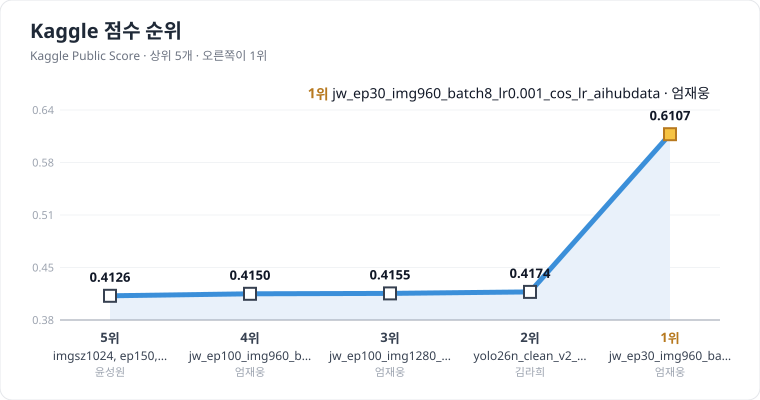

# pill-detection

YOLO로 이미지 속 알약을 탐지하고 종류를 분류하는 프로젝트입니다. (코드잇 AI 엔지니어 과정 초급 프로젝트)

- **입력**: 여러 알약이 함께 놓인 이미지 (976 × 1280, 한 장에 3~4알)
- **출력**: 알약별 바운딩 박스 + 클래스 + 신뢰도
- **데이터**: Kaggle 대회 `ai14-level-project` 제공 데이터 + AI Hub 「경구약제 이미지 데이터」 조합 데이터
- **평가**: Kaggle 리더보드 **mAP[0.75:0.95]**, 최종 순위는 Private Score 기준
- **팀**: 팀 파이리 4명 / 2026.09.10 ~ 09.29

📄 [최종 보고서](docs/알약_객체_검출_최종보고서.pdf) · 📊 [발표 자료](docs/최종발표.pdf)

## 최종 결과

**Kaggle 0.62550** · AI Hub 데이터로 118종까지 늘려 학습한 YOLO26n 두 개를 WBF로 합친 구성입니다. 첫 제출 0.235552에서 2.65배가 됐습니다.

| 구간 | Kaggle 점수 | 얻은 폭 |
|---|---|---|
| 기본 설정 → 하이퍼파라미터 조정 | 0.235552 → 0.41550 | +0.180 |
| AI Hub 데이터 통합 (56종 → 118종) | 0.41550 → 0.61074 | **+0.195** |
| 오버샘플링 + WBF 앙상블 | 0.61074 → 0.62550 | +0.015 |

- **성능을 가로막은 건 학습 설정이 아니라 데이터였습니다.** 하이퍼파라미터 7가지를 하나씩 바꿔도 점수는 0.39132~0.41738(폭 0.026)에 머물렀습니다. test에 train 56종에 없는 알약이 섞여 있었기 때문이고, AI Hub 데이터를 더하자 한 번에 +0.195가 올랐습니다.
- **로컬 val 점수는 판단 기준이 되지 못했습니다.** val은 줄곧 0.97~0.99였고 두 점수가 반대로 움직인 실험도 있어서, 모든 판단은 Kaggle 점수로 했습니다.
- **앙상블은 서로 다르게 학습한 모델끼리 합쳐야 효과가 있었습니다.** 같은 모델의 멀티스케일 TTA는 변화가 없었고(0.61084 → 0.61060), 다른 조건으로 학습한 두 모델을 비중 1 : 1.3으로 합쳤을 때 0.62550이 나왔습니다.

자세한 과정은 [결과](#결과), Kaggle 점수 TOP 5는 [실험 기록](#실험-기록)에서 볼 수 있습니다.

## 시작하기

```bash
git clone <repo-url>
cd pill-detection
uv sync
```

`uv sync`만 하면 팀원 전원이 동일한 환경이 됩니다. 패키지는 `uv add <pkg>`로 추가하고 `uv.lock`을 꼭 커밋합니다. (`pip` 사용 금지)

프로젝트 루트에 `.env`를 만듭니다. `.env`는 gitignore 되어 있으며 **절대 커밋하지 않습니다.**

```
KAGGLE_USERNAME=<캐글 아이디>
KAGGLE_KEY=<API 키>
AI_HUB_KEY=<AI Hub API 키>                  # AI Hub 데이터 다운로드용
SHEET_URL=<실험 기록 구글 시트 웹앱 URL>   # 팀 채팅으로 공유
AUTHOR=<본인 이름>                          # 실험 기록의 author 칸
```

## 전체 실행 순서

```bash
uv run --env-file .env python -m src.data.download_data   # 1. Kaggle 데이터 다운로드
uv run python -m src.data.download_aihub                 #    AI Hub 조합 데이터 다운로드 (약 21GB)
uv run python -m src.data.make_yolo                      # 2. 라벨 정리 + COCO JSON → YOLO 변환 + train/val 분할 + 오버샘플링
uv run python -m src.data.check_yolo                     #    변환 결과 검증
uv run python -m src.train.train_yolo                    # 3. 학습 + val 평가 + 실험 기록(csv·구글 시트)
uv run python -m src.analysis.visualize                  # 4. val 예측 시각화 · 실패 사례 · 클래스별 점수
uv run python -m src.analysis.predict                    # 5. test 예측 → Kaggle 제출 파일 (기본: 두 모델 WBF 앙상블)
uv run python -m src.analysis.visualize_ensemble         #    앙상블 예측 시각화
```

모든 스크립트는 **프로젝트 루트에서 `python -m src.폴더.파일`** 형태로 실행합니다. (`python src/data/make_yolo.py` 처럼 경로로 실행하면 `from src.config import ...` 를 찾지 못합니다)

## AI Hub 데이터 추가 (최고 점수 재현에 필요)

test 에는 Kaggle train 56종에 없는 알약이 섞여 있어서(확인된 것만 18종), AI Hub 「경구약제 이미지 데이터」(datasetkey 576)의 **조합** 데이터를 train 에 더해 클래스를 118종으로 늘렸습니다. Kaggle 0.41550 → **0.61074**.

**0. 준비** · [aihub.or.kr](https://aihub.or.kr) 에서 데이터 이용 신청 후 API 키를 발급받아 `.env` 에 `AI_HUB_KEY=...` 로 넣습니다. (커밋 금지)

**1. 다운로드** · 한 줄로 받습니다. 파일 하나씩 받고 → 조각 합치고 → 압축 풀고 → zip 삭제 순서라 디스크 여유는 25GB 정도면 되고, 중간에 멈추면 이미 받은 것은 건너뛰고 이어서 받습니다. (라벨 55MB + 이미지 약 21GB)

```bash
uv run python -m src.data.download_aihub
```

- ⛔ `TL_2_조합`(66066), `TS_2_조합`(66155) 은 대회 train/test 원본이라 **받지 않습니다** (스크립트에서 제외).
- ⚠️ 공식 `aihubshell`(v0.6) 은 macOS 에서 한글 파일명 조각을 합치지 못해 **빈 zip 을 만들고 조각을 삭제**합니다(bash 3.2 의 `printf %q` 문제). 그래서 같은 API 를 직접 호출하는 위 스크립트를 씁니다.

**2. 데이터셋 만들기** · `src/config.py` 의 `USE_AIHUB` 로 전환합니다.

| 값 | 쓰는 데이터셋 | 용도 |
|---|---|---|
| `True` | `data/yolo_aihub/` (Kaggle + AI Hub, 118종) | 최고 점수 재현 (기본값) |
| `False` | `data/yolo/` (Kaggle 만, 56종) | 이전 실험 재현 |

```bash
uv run python -m src.data.make_yolo     # train 10,394장(Kaggle 183 + AI Hub 10,211) + 오버샘플링 복제 808장 / val 37장
uv run python -m src.data.check_yolo    # 라벨 11,239개 불일치 0개
```

- **클래스:** AI Hub 라벨은 `categories` 가 전부 `1 "Drug"` 이라, 대회와 같은 약 ID 를 얻으려면 `images[0].drug_N`(예: `K-033880` → 33880)을 쓴다. (`dl_idx` 는 1 차이라 쓰면 안 됨)
- **val 은 항상 Kaggle 37장:** AI Hub 이미지는 train 에만 들어가서 이전 실험과 val 점수를 비교할 수 있다.
- **제외:** 깨진 JSON·좌표 131장, 문제 이미지 155장(`remove_bad_images`), 조합 안내용 `*_index.png`
- **촬영 각도:** `make_yolo.py` 의 `AIHUB_ANGLES` 로 고른다. 기본은 70°·75°·90° 전부이고, 학습 시간을 줄이려면 75° 와 거의 같은 `"70"` 을 뺀다.
- **디스크:** 이미지는 복사가 아니라 하드링크로 연결해서 추가 용량을 쓰지 않는다.
- **epoch:** 데이터가 약 56배로 늘어서 epoch 를 100 → 30 으로 줄이고, `warmup_epochs`·`close_mosaic` 도 같은 비율로 줄였다. (그대로 두면 학습 전체에서 차지하는 비중이 커진다)

## 디렉터리

```
data/raw/        Kaggle 원본 데이터 (git 제외)
data/aihub/      AI Hub 조합 데이터 (git 제외, 라벨 labels/TL_n · 이미지 images/TS_n)
data/yolo/       Kaggle 만으로 만든 YOLO 데이터셋 (git 제외)
data/yolo_aihub/ Kaggle + AI Hub YOLO 데이터셋 (git 제외)
runs/            학습 결과 · 가중치 · 분석 그림 · 제출 파일 (git 제외)
src/             공통 모듈 (config · annotations · sheet)
src/data/        데이터 다운로드 · 확인 · YOLO 변환
src/train/       학습 (YOLO, Faster R-CNN · RetinaNet 비교용, 대조학습)
src/analysis/    예측 · 앙상블 · 시각화 · README 그래프
docs/images/     README 실험 그래프 (GitHub Actions가 자동 갱신)
.github/         이슈·PR 템플릿, README 그래프 갱신 워크플로
```

| 파일 | 역할 |
|---|---|
| `src/config.py` | 공통 경로(`KAGGLE_DIR`, `YOLO_DIR`, `RUNS_DIR` 등) · `USE_AIHUB` · `SEED` · `get_device` |
| `src/annotations.py` | (이미지 × 알약)당 JSON 1개인 라벨을 이미지 파일명 기준으로 묶기 · `compute_iou` |
| `src/sheet.py` | 구글 시트(Apps Script 웹앱)로 실험 기록 전송 |
| `src/data/download_data.py` | Kaggle 대회 데이터를 `data/raw/`에 다운로드 |
| `src/data/download_aihub.py` | AI Hub 조합 데이터를 `data/aihub/`에 다운로드 (받기 → 조각 병합 → 압축 해제) |
| `src/data/check_raw.py` | 원본 데이터 요약 + 박스 시각화 |
| `src/data/make_yolo.py` | 문제 있는 이미지 제외 → YOLO 라벨 변환 → 조합 단위 train/val 분할 → 취약 클래스 오버샘플링 |
| `src/data/check_yolo.py` | YOLO 라벨을 픽셀로 되돌려 원본과 비교 |
| `src/data/make_pseudo.py` | test 예측을 의사 라벨로 train 에 더한 데이터셋 만들기 (실험용) |
| `src/train/train_yolo.py` | YOLO 학습, val 평가(mAP75-95), 실험 기록 |
| `src/train/train_rcnn.py` | Faster R-CNN · RetinaNet 학습 (모델 비교용) |
| `src/train/train_contrastive.py` | 알약 크롭 임베딩 대조학습 (실험용) |
| `src/analysis/visualize.py` | val 예측/정답 비교 그림, 오류 유형 집계, 클래스별 AP, 학습 곡선 |
| `src/analysis/predict.py` | test 842장 예측 → 제출 형식 csv (단일 / 멀티스케일 TTA / 두 모델 WBF 앙상블) |
| `src/analysis/visualize_ensemble.py` | 앙상블 예측 시각화 (test 박스, val 실패 사례) |
| `src/analysis/filter_unknown.py` | 모르는 알약으로 보이는 박스 점수 낮추기 (실험용, 미사용) |
| `src/analysis/predict_contrastive.py` | 대조학습 임베딩으로 예측 클래스 재분류 (실험용) |
| `src/analysis/plot_experiments.py` | 시트 기록으로 README 실험 그래프(SVG) 생성 |

## 데이터

```
data/raw/sprint_ai_project1_data/
├── train_images/        학습 이미지 (.png)
├── train_annotations/   K-<조합>_json/K-<약품코드>/*.json
└── test_images/         제출용 이미지 (.png, 라벨 없음, 파일명 = 숫자)
```

어노테이션은 **(이미지 × 알약)당 JSON 1개**인 COCO 형식이고, bbox는 `(x, y, w, h)` 픽셀 좌표(좌상단 기준)입니다. 박스 외에 제품명·제조사·각인(`print_front`)·촬영 각도·앞뒷면(`drug_dir`)도 들어 있어 실패 원인을 찾을 때 썼습니다.

| 항목 | 값 |
|---|---|
| train 이미지 | 232장 |
| 박스 (JSON) | 763개 |
| 클래스 | 56개 (한 종류당 평균 약 4장) |
| test 이미지 | 842장 |
| 이미지당 알약 수 | 2알 7장 / 3알 151장 / 4알 74장 |
| 이미지 크기 | 976 × 1280 (train·test 전체) |

**어려운 점** · 위치보다 **종류를 맞히는 것**이 어렵습니다. 색·모양·크기가 거의 같고 각인만 다른 알약이 많고(예: 콜린알포세레이트 연질캡슐 19232 · 32310 · 18357), 뒷면이 찍히면 각인이 보이지 않습니다.

외부 데이터는 사용 가능하지만, AI Hub의 아래 2개는 **사용 금지**입니다. (경진대회 train/test 데이터의 원본)

- `Training > 라벨링데이터 > 경구약제조합 5000종 > TL_2_조합.zip`
- `Training > 원천데이터 > 경구약제조합 5000종 > TS_2_조합.zip`

## 전처리

`src/data/make_yolo.py`가 아래 순서로 `data/yolo/`(또는 `data/yolo_aihub/`)를 만듭니다.

**1. 문제 있는 이미지 제외 (232장 → 220장)**

| 제외 이유 | 장수 | 판단 방법 |
|---|---|---|
| 박스가 이미지 밖 | 1 | 좌표가 이미지 크기를 넘음 (x=6567) |
| 라벨 빠짐 | 8 | 파일명의 약 ID(`K-003351-032310-038162` → 3351·32310·38162) 중 박스 라벨이 없는 약이 있음 |
| 라벨 겹침 | 3 | 한 알약 박스에 서로 다른 약 라벨 2개가 붙어 있음 (IoU 0.9 이상) |

박스만 빼지 않고 이미지째 뺍니다. 라벨이 빠진 알약은 학습 때 '배경'으로 배워서 모델이 그 알약을 무시하게 되기 때문입니다. 제외해도 train에서 사라지는 클래스는 없습니다.

**2. 클래스 번호** · 약 ID(1900, 2483, …)를 오름차순 정렬해 YOLO 번호 0부터 매핑. 정렬 기준이 고정이라 누가 실행해도 같은 번호가 나오고, `data.yaml`의 `names`가 번호 → 약 ID 표입니다.

**3. train/val 분할** · **조합 단위**로 8:2 (seed 42). 같은 조합을 70°/75°/90°로 찍은 사진이 train과 val에 섞이면 val 점수가 부풀려지기 때문입니다. 나눈 뒤 train에 없는 약이 생기면 그 조합을 val에서 train으로 옮깁니다.

| 결과 | 값 |
|---|---|
| train / val | 183장 / 37장 |
| train에 없는 클래스 | 없음 (val에만 들어간 약 `33009`의 조합을 train으로 되돌림) |
| 변환 검증 (`check_yolo.py`) | 라벨 220개, 원본과 불일치 0개 |

**4. 오버샘플링** · 점수가 뒤처진 약(`OVERSAMPLE_CLASSES = {35206, 3832}`)이 있는 **train** 이미지를 `OVERSAMPLE_FACTOR = 2`배로 넣습니다. `_dup1` 이름의 하드링크라 디스크를 더 쓰지 않고, val은 복제하지 않습니다. 3832의 AP가 0.932 → 0.995로 회복했지만 18147이 0.931로 떨어졌고, 3배로 올리면 오히려 점수가 내려갔습니다(0.60591).

## 학습

`src/train/train_yolo.py` 위쪽 설정만 바꿔서 실험합니다. 아래는 최고 점수(모델 B) 설정입니다.

```python
MODEL  = "yolo26n.pt"     # 모델 크기
EPOCHS = 30               # 학습 바퀴 수 (AI Hub 데이터 기준)
IMGSZ  = 960              # 입력 이미지 크기
BATCH  = 8                # 한 번에 넣는 사진 수
NAME   = "jw_ep30_img960_batch8_aihubdata_oversample_f2"  # 실험 이름 = runs/<NAME>/ (실험마다 새 이름)
MEMO   = "무엇을 왜 바꿨는지 한 줄"
EXPERIMENT = {
    "optimizer": "AdamW",
    "lr0": 0.001,
    "cos_lr": True,
    "warmup_epochs": 1.5,
    "close_mosaic": 3,    # 마지막 3 epoch 는 mosaic 끄기 (전체의 10%)
    "box": 12.0,          # 박스 손실 비중 ↑ (IoU 0.75 이상만 채점하는 대회라)
    "cls": 1.0,
}
```

- **한 실험에서는 설정 하나만** 바꾸고, NAME은 `이니셜_모델_ep_img_b_바꾼점`으로 짓습니다(예: `jw_yolo26n_ep50_img640_b4_compare`). 같은 NAME이면 결과가 덮어써집니다.
- `optimizer`가 기본값 `auto`면 `lr0`·`momentum`을 넣어도 무시됩니다. 학습률을 바꿀 땐 `optimizer`도 같이 지정합니다.
- EPOCHS가 다르면 워밍업 비율·mosaic 끄는 시점도 달라집니다. 같은 EPOCHS끼리 비교합니다.
- 16GB 맥(MPS)에서는 IMGSZ 1280이면 BATCH 4, 960이면 BATCH 8이 한계입니다. AI Hub 데이터로 960 · BATCH 8 1 epoch에 약 27분(M2 Pro) 걸립니다.

학습이 끝나면 best.pt로 val을 평가해 mAP50 / mAP50-95 / **mAP75-95**(대회 지표 구간)를 출력하고, `runs/experiments.csv`와 구글 시트에 한 줄 기록합니다.

| 결과 파일 | 내용 |
|---|---|
| `runs/<NAME>/weights/best.pt` | val mAP50-95가 가장 높았던 가중치 |
| `runs/<NAME>/args.yaml` | 실제로 쓰인 설정값 전체 (기본값 포함) |
| `runs/<NAME>/results.csv` | epoch별 loss · mAP · 학습률 |
| `runs/<NAME>_val/` | confusion matrix, PR 곡선 |
| `runs/experiments.csv` | 실험마다 점수 + 학습 인자 (로컬 백업) |

## 평가 · 시각화

```bash
uv run python -m src.analysis.visualize            # train_yolo.py 의 NAME 실험을 분석
uv run python -m src.analysis.visualize_ensemble   # predict.py 의 앙상블(모델 A+B)을 분석 → runs/ensemble_analysis/
```

val 예측을 정답과 IoU로 짝지어 분류하고 `runs/<NAME>_analysis/`에 저장합니다.

| 분류 | 뜻 |
|---|---|
| OK | 클래스·위치 모두 맞음 (IoU 0.75 이상) |
| LOC | 클래스는 맞고 위치 부정확 (IoU 0.75 미만) |
| CLS | 위치는 맞고 클래스 틀림 |
| DUP | 같은 알약에 예측을 2개 냄 |
| FP | 알약이 없는 곳을 예측 |
| FN | 정답 알약을 놓침 |

- `failures.png` · 실패가 있는 이미지 6장. 박스 **위 글자 = 모델 예측**, **아래 글자 = 정답 라벨**
- `class_ap.csv` · 클래스별 AP50 · AP75-95 (낮은 순)
- `curves.png` · epoch별 box/cls loss, val mAP

## 결과

**1. 모델 선택** · 같은 조건(50 epoch · 640 · BATCH 4 · MPS)에서 비교했습니다. YOLO는 RetinaNet 점수의 98.6%를 내면서 학습 시간은 44%라, 실험을 더 많이 돌릴 수 있는 YOLO26n을 기본 모델로 정했습니다.

| 모델 | 방식 | val mAP75-95 | 학습 시간 |
|---|---|---|---|
| Faster R-CNN | 2단계 | 0.8599 | 61분 8초 |
| RetinaNet | 1단계 | 0.9584 | 33분 28초 |
| **YOLO26n** | 1단계 | 0.9451 | **14분 37초** |

**2. 실험 흐름** · 앞 실험의 실패 사례를 보고 가설을 세워 설정 하나씩 바꿨습니다.

| 단계 | 바꾼 것 | val mAP75-95 | Kaggle | 관찰 |
|---|---|---|---|---|
| 기본 설정 | yolo26n · 640 · 50 epoch · BATCH 16 | 0.7179 | 0.235552 | 위치는 맞는데 비슷한 알약을 헷갈림 |
| 해상도·학습량 | 960 · 100 epoch · AdamW lr0 0.001 | 0.9321 | 0.39139 | 33009를 아예 못 찾음 |
| val 재분할 | 조합 단위 분할 + train 누락 보정 | 0.984 | 0.41503 | 각인만 다른 알약 혼동이 남음 |
| 해상도 1280 | 960 → 1280, BATCH 8 → 4 | 0.984 | 0.40805 | val 은 좋아졌는데 Kaggle 은 하락 |
| cos_lr | 학습률 코사인 감쇠 | 0.9784 | 0.41550 | val 은 하락, Kaggle 은 상승 |
| **AI Hub 추가** | 56종 → 118종, 30 epoch | 0.9929 | **0.61074** | 3832 하나만 AP 0.932로 뒤처짐 |
| 오버샘플링 | 35206 · 3832 2배 | - | 0.61802 | 3832 AP 0.995로 회복 |
| **WBF 앙상블** | 모델 A + B, 비중 1 : 1.3 | - | **0.62550** | 최종 |

**3. 0.41의 벽** · AI Hub 전에는 하이퍼파라미터 7가지를 하나씩 바꿔도 Kaggle 점수가 0.026 폭 안에만 있었습니다. val은 전부 0.97 이상이었습니다.

| Kaggle | 실험 | 바꾼 것 | val mAP75-95 |
|---|---|---|---|
| 0.41738 | 해상도 1280 | 해상도 | 0.995 |
| 0.41550 | cos_lr | 학습률 스케줄 | 0.9784 |
| 0.41504 | val 재분할 | 데이터 나누는 방식 | 0.984 |
| 0.41467 | yolo26s | 모델 크기 | 0.981 |
| 0.40516 | freeze 10 | 전이학습 | 0.9738 |
| 0.40316 | cls_pw 0.5 | 손실 가중치 | 0.9776 |
| 0.39132 | mosaic 0.5 | 증강 | 0.976 |

**4. WBF 앙상블** · 서로 다른 조건으로 학습한 두 모델을 합쳤습니다. 반반으로 섞으면 약한 모델 A의 오차가 그대로 들어와서, 더 강한 B에 비중을 실었습니다.

| 항목 | 모델 A | 모델 B |
|---|---|---|
| 해상도 / 배치 / epoch | 1280 / 4 / 50 | 960 / 8 / 30 |
| 오버샘플링 | 1배 | 2배 (35206 · 3832) |
| 단독 Kaggle | 0.61802 | 0.62041 |

| 구성 | Kaggle | 단독 최고 대비 |
|---|---|---|
| 모델 B 단독 | 0.62041 | - |
| 앙상블 1 : 1 | 0.62054 | +0.00013 |
| **앙상블 1 : 1.3** | **0.62550** | **+0.00509** |

**5. 효과가 없었던 실험**

| 실험 | 가설 | Kaggle |
|---|---|---|
| CLAHE 전처리 | 대비를 높이면 각인이 선명해진다 | 0.61084 → 0.6072 (배경에 얼룩이 생겨 알약 경계로 오인) |
| 멀티스케일 TTA + WBF | 같은 모델을 크기만 바꿔 합치면 좋아진다 | 0.61084 → 0.61060 (세 예측이 거의 같아 새 정보 없음) |
| 오버샘플링 3배 | 더 많이 복제하면 더 좋아진다 | 0.61084 → 0.60591 (배율을 올리고 대상도 바꿨더니 하락) |
| 모르는 알약 필터 | 학습에 없는 알약 박스 점수를 낮춘다 | 약 0.415 → 0.41699 (AI Hub 전, 효과가 작아 사용 안 함) |

**6. 남은 실패 유형** · 최종 모델은 val에서 알약 이름을 거의 틀리지 않습니다. 남은 건 한 알약에 박스가 2개 남는 **중복 예측**과 가장자리 빈 곳의 **배경 오탐**인데, 둘 다 신뢰도 0.00~0.01이라 mAP에는 거의 영향이 없습니다.

## 실험 기록

<!-- 실험그래프 시작 -->
### 🏆 Kaggle 점수 TOP 5



| 순위 | kaggle_score | name | author | val mAP75-95 | 시간 | memo |
|---|---|---|---|---|---|---|
| 1 | 0.61074 | jw_ep30_img960_batch8_lr0.001_cos_lr_aihubdata | 엄재웅 | 0.9929 | 09-18 11:52 | epochs: 30 / imgsz: 960 / batch: 8 / lr: 0.001 / cos_lr: True / warmup 1 · close_mosaic 3 (100 epoch 와 같은 비율) / AI Hub 조합 데이터 추가 (train 10,394장, 118종) |
| 2 | 0.41738 | yolo26n_clean_v2_imgsz1280 | 김라희 | 0.995 | 09-17 18:09 | yolo26n_clean_v2와 EXPERIMENT·epochs(150)·patience(60) 전부 동일, imgsz만 960→1280으로 변경해 크기 효과만 확인 (기존 1280_v3는 degrees=15·cls 1.5도 같이 바뀌어 크기 효과와 분리 안 됐음) |
| 3 | 0.4155 | jw_ep100_img1280_batch4_lr0.001_cos_lr | 엄재웅 | 0.9784 | 09-17 19:58 | epochs: 100 / imgsz: 1280 / batch: 4 / lr: 0.001 / cos_lr: True |
| 4 | 0.41504 | jw_ep100_img960_batch8_lr0.001_resplit | 엄재웅 | 0.984 | 09-16 09:59 | epochs: 100 / imgsz: 960 / batch: 8 / lr: 0.001 / val 재분할(train에 모든 클래스가 학습될 수 있도록) |
| 5 | 0.41264 | imgsz1024, ep150, batch=4 | 윤성원 | 0.9918 | 09-16 16:11 | imgsz=1024, batch=4 가 현재까지 점수가 제일 좋아 EPOCHS=150으로 값 조정 |
<!-- 실험그래프 끝 -->

## 실험 기록 자동화

```
train_yolo.py 학습 종료
  └─ 구글 시트 experiments 탭에 한 줄 추가 (Apps Script 웹앱)
       └─ GitHub에 신호 → Actions가 시트를 읽어 README 그래프 갱신
            └─ docs/readme-graph 브랜치로 PR 생성 → 팀장이 확인 후 머지
```

| 시트 열 | 입력 |
|---|---|
| time, author, name, memo, mAP50, mAP50-95, mAP75-95, model, epochs, imgsz, batch, seed, experiment | 자동 (`train_yolo.py`) |
| kaggle_score, 결론 / 다음 실험 | **직접 입력** |

- `SHEET_URL`은 `.env`와 저장소 Secret에만 두고 공개하지 않습니다.
- README 아래 「실험 기록」의 표시 영역은 자동으로 바뀌므로 직접 수정하지 않습니다.
- 다음 실험 방향은 시트를 보고 팀이 판단합니다.

## 예측 · 제출

```bash
uv run python -m src.analysis.predict
```

`src/analysis/predict.py` 위쪽 스위치로 방식을 고릅니다. (우선순위: 앙상블 > TTA > 단일)

| 설정 | 방식 | 결과 파일 |
|---|---|---|
| `USE_ENSEMBLE = True` (기본) | 모델 A(1280) + 모델 B(960) 예측을 WBF로 합침 (비중 1 : 1.3, IoU 0.55) | `runs/ensemble_f2_960_ratio_submission.csv` |
| `USE_TTA = True` | 같은 모델을 `IMGSZ ± 128` 세 크기로 예측 후 WBF | `runs/<NAME>/submission.csv` |
| 둘 다 `False` | `train_yolo.py` 의 NAME 실험 best.pt 로 단일 예측 | `runs/<NAME>/submission.csv` |

- 앙상블 체크포인트(`WEIGHTS_A`, `WEIGHTS_B`)는 git에 없습니다. 공유 드라이브에서 받아 `runs/<실험 이름>/weights/best.pt` 에 넣습니다.
- 두 모델은 같은 `data.yaml`(118종)로 학습해야 합니다. 클래스 매핑이 다르면 `assert`로 멈춥니다.

```
annotation_id, image_id, category_id, bbox_x, bbox_y, bbox_w, bbox_h, score
```

- `image_id` = test 파일명 숫자, `category_id` = 원래 약 ID (YOLO 번호 아님), bbox = 원본 이미지 픽셀 좌표
- `CONF = 0.001` · mAP는 신뢰도 높은 순으로 채점해서 낮은 박스는 점수를 거의 깎지 않고, 그중 하나라도 맞으면 점수가 오릅니다. 그래서 결과 그림에 배경 박스가 많이 보여도 의도한 것입니다. (서비스로 쓴다면 0.25 정도로 올려야 함)

**제출은 사람이 Kaggle 웹에서 직접 합니다.**

1. **팀 계정으로** 업로드 (개인 제출 금지, 팀 전체 하루 10회)
2. 설명칸에 `NAME / conf0.001` 형식으로 작성
3. 점수가 나오면 구글 시트의 해당 행 `kaggle_score`에 입력

## 알려진 이슈

- **로컬 val ≠ Kaggle** · val(37장)에는 train에 없는 알약이 없어서 0.97~0.99가 나오지만 Kaggle은 그보다 훨씬 낮고, 방향이 반대인 실험(해상도 1280, cos_lr)도 있었습니다. 판단은 Kaggle 점수로 합니다.
- val이 37장이라 0.01~0.02 차이는 우연일 수 있습니다.
- 맥 GPU(mps)에서는 일부 연산이 비결정적이라, 장치가 다르면 같은 설정·시드로도 점수가 조금 다릅니다. (같은 맥에서는 50 epoch baseline 두 번 모두 0.7225)
- 모델은 118종 중 하나를 반드시 고르기 때문에, 처음 보는 알약에도 틀린 이름을 냅니다. ("미등록 알약" 판별은 미구현)

## 진행 단계

| 단계 | 내용 | 상태 |
|---|---|---|
| 1. 데이터 준비 | Kaggle 데이터 다운로드, 어노테이션 로드·시각화, AI Hub 조합 데이터 추가 | ✅ 완료 (56종 → 118종) |
| 2. 전처리 | 라벨 오류 이미지 제외 → COCO JSON→YOLO 변환 → 조합 단위 분할 → 오버샘플링 → 변환 검증 | ✅ 완료 |
| 3. 학습 | 모델 비교(Faster R-CNN · RetinaNet · YOLO) → 하이퍼파라미터 조정 → AI Hub 데이터 → 앙상블 | ✅ 완료 |
| 4. 평가 | mAP[0.75:0.95], 클래스별 AP, 시각화, confusion matrix, 실패 사례 | ✅ 완료 |
| 5. 제출·문서화 | Kaggle 제출, README · 최종 보고서 · 발표 | ✅ 완료 (최종 0.62550) |

## 향후 과제

| 과제 | 내용 | 우선순위 |
|---|---|---|
| 데이터 추가 확장 | AI Hub에 아직 쓰지 않은 단독·조합 데이터가 남아 있음 | 높음 |
| 3개 모델 앙상블 | 모델을 하나 더 추가하고 WBF 설정 다듬기 (재학습 불필요) | 중간 |
| 모르는 알약 거부 | 배우지 않은 알약에 "미등록 알약"이라고 답하기. 대회 점수와는 무관하나 서비스에는 필수 | 낮음 |
| 노이즈 걸러내기 | 가장자리 배경 박스 제거. 점수와는 무관하고 사용성에만 관련 | 낮음 |

## 협업 방식

- 단계별로 브랜치 1개를 만들고 4명이 같은 브랜치에서 작업합니다.
- 작업 시작 전 `git pull`, 완료 즉시 `git push`.
- 같은 파일을 수정하기 전에 팀 채팅에 먼저 공유합니다.
- 재현 가능하도록 랜덤 시드를 고정합니다.

### 컨벤션

타입은 `feat` / `fix` / `chore` / `design` / `docs` / `refactor` 6개입니다.

| 대상 | 형식 | 예시 |
|---|---|---|
| Branch | `타입/#이슈번호-작업내용` | `feat/#11-json-to-yolo` |
| Commit | `타입: 작업 내용` | `feat: JSON→YOLO 라벨 변환 구현` |
| Issue / PR | `[타입] 작업 내용` | `[Feat] JSON→YOLO 라벨 변환` |

```
# Branch
feat/#11-json-to-yolo
fix/#12-label-bbox-bug

# Commit
feat: JSON→YOLO 라벨 변환 구현
fix: 바운딩 박스 좌표 오류 수정
chore: 개발 환경 세팅
docs: README 업데이트
refactor: 전처리 스크립트 리팩토링

# Issue / PR
[Feat] JSON→YOLO 라벨 변환
[Fix] 바운딩 박스 좌표 오류 수정
```

## 👥 팀

<div align="center">

### 팀 파이리 (파트2_1팀)


|  |  |  |  | 
|:---:|:---:|:---:|:---:|
| **[엄재웅](https://github.com/woolnd)** | **[윤성원](https://github.com/UchimataDev)** | **[김라희](https://github.com/KIMRAHUI)** | **[신재민](https://github.com/soul8327)** |
| 팀장 | 모델 개발 | 모델 개발 | 모델 개발 |

</div>

### 📝 협업 일지

| 날짜 | 엄재웅 | 윤성원 | 김라희 | 신재민 |
|:---:|:---:|:---:|:---:|:---:|
| 09-10 | [📝](https://smoggy-gymnast-0ed.notion.site/26-09-10-3d777fa64f7f8011a5fff6741aa963e0?source=copy_link) | [📝](https://smoggy-gymnast-0ed.notion.site/26-09-10-3d777fa64f7f807fbe4ccff5b42ed249?source=copy_link) | [📝](https://smoggy-gymnast-0ed.notion.site/09-10Daily-3d777fa64f7f8038a483e9c31208eccb?source=copy_link) | [📝](https://smoggy-gymnast-0ed.notion.site/26-09-10-3d777fa64f7f80bcab5cc5a66ead2e4a?source=copy_link) |
| 09-11 | [📝](https://smoggy-gymnast-0ed.notion.site/26-09-11-3d877fa64f7f806980ddd7e45f4a2ca3?source=copy_link) | [📝](https://smoggy-gymnast-0ed.notion.site/26-09-11-3d877fa64f7f804e9cb5dfc1a8e21cec?source=copy_link) | [📝](https://smoggy-gymnast-0ed.notion.site/09-11Daily-3d877fa64f7f80898b9ee0aa0779e13f?source=copy_link) | [📝](https://smoggy-gymnast-0ed.notion.site/26-09-11-3d877fa64f7f80ff9004eaf0e55b2328?source=copy_link) |
| 09-14 | [📝](https://smoggy-gymnast-0ed.notion.site/26-09-14-3db77fa64f7f801592fde3c9620f62ea?source=copy_link) | [📝](https://smoggy-gymnast-0ed.notion.site/26-09-14-3db77fa64f7f80309ad5ee063b2dbd33?source=copy_link) | [📝](https://smoggy-gymnast-0ed.notion.site/09-11Daily-3db77fa64f7f80d69c09d018888a360a?source=copy_link) | [📝](https://smoggy-gymnast-0ed.notion.site/26-09-14-3db77fa64f7f800483c3e382ec222b57?source=copy_link) |
| 09-15 | [📝](https://smoggy-gymnast-0ed.notion.site/26-09-15-3dc77fa64f7f802db9c7c4ece66ef915?source=copy_link) | [📝](https://smoggy-gymnast-0ed.notion.site/26-09-15-3dc77fa64f7f8060a4ddf31fe213a441?source=copy_link) | [📝](https://smoggy-gymnast-0ed.notion.site/09-15Daily-3dc77fa64f7f8024a953ea2277fea760?source=copy_link) | [📝](https://smoggy-gymnast-0ed.notion.site/26-09-15-3dc77fa64f7f80618184ec4d933baba7?source=copy_link) |
| 09-16 | [📝](https://smoggy-gymnast-0ed.notion.site/26-09-16-3dd77fa64f7f809d8e75cd6c818f31b7?source=copy_link) | [📝](https://smoggy-gymnast-0ed.notion.site/26-09-16-3dd77fa64f7f80b38f52d031552e57f6?source=copy_link) | [📝](https://smoggy-gymnast-0ed.notion.site/9-16-3dd77fa64f7f80149b63c1c5b4c55878?source=copy_link) | [📝](https://smoggy-gymnast-0ed.notion.site/26-09-16-3dd77fa64f7f804ba599c6265f48a574?source=copy_link) |
